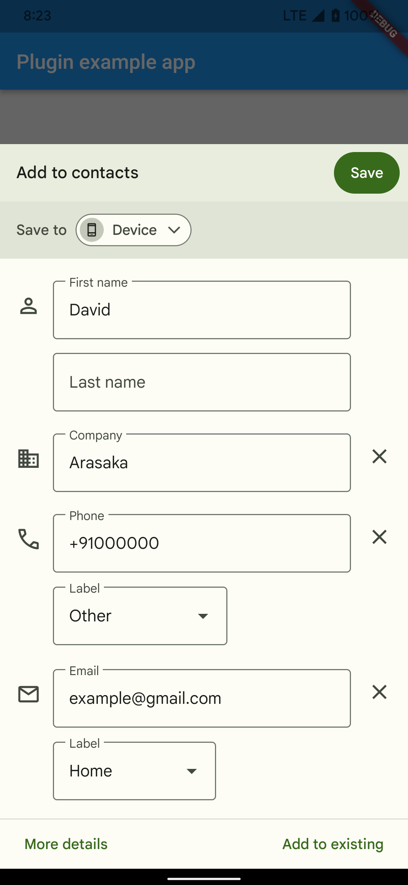
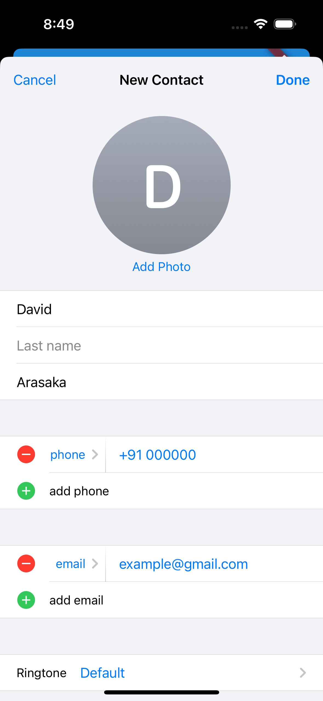

# contact_sheet

Flutter plugin to show Contact sheet without any permissions  
- arguments 
  - name
  - organisation
  - email
  - list of numbers

## Reference

- Just call `ContactSheet().open()` to open native contact sheet

## Screenshots

Android | IOS
--- | ---
 | 
